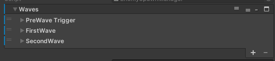
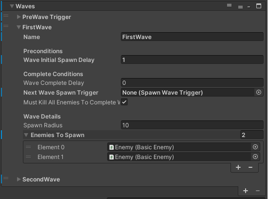
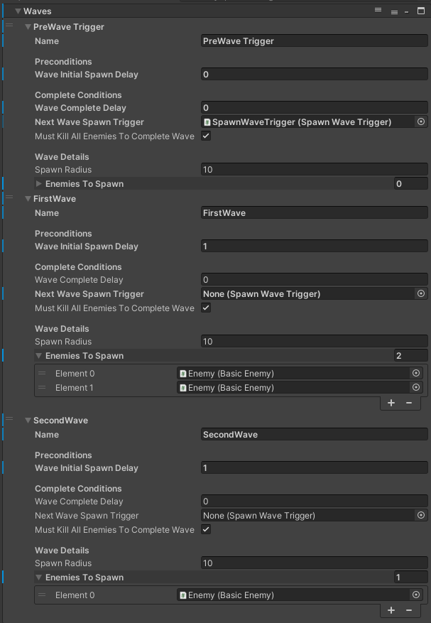

# Dialogue System

## Adding new Actor to the HUB

To add a new Actor to the hub

**In the Dialogue Editor Menu:**

The Dialogue Editor Menu can be found at the menu bar up the top under Tools->Pixel Crushers->Dialogue System->Dialogue Editor.
- Select the Actors tab (in between Database & Quests/Items) and Add a new Actor to the list.
- Change the _Name_ of the newly created actor and make sure it is selected, view the details of the actor in the right hand side inspector.
- Make a note of the _ID_ field (should be uneditable) and recall this as _ActorID_.
- Open the _Portrait Textures_ dropdown and drag in the actor's portrait art (Will eventually be replaced with _Portrait Sprites_ in due time)

**In the Hub_Location Scene:**

The Hub_Location scene can be found in the Project files under Scenes/Locations/Hub_Location.unity
- In the hierarchy, Duplicate a pre-existing _NPC GameObject_ (i.e. Herbert) and rename AND REPOSITION IT WITHIN THE SCENE SO IT DOES NOT OVERLAP. Make sure the GameObject is disabled (Dark grey in the hierarchy)
- Keeping it selected, within the right hand side inspector, assign _Actor ID_ under the Hub NPC script to the previously noted _ActorID_ from the corresponding Actor entry under the Dialogue Editor Menu.
- Under the NPCHubManager object in the hierarchy, In the Hub NPC Manager script, open the Actors dropdown.
- Create a new element in the list, and drag in the newly created/duplicated _NPC GameObject_.

The Actor should now be properly configured and become enabled once they have a conversation that allows them to spawn.

## Adding new conversation

**In the Dialogue Editor Menu:**
- Select the Conversations tab (in between Variables & Templates).
- Directly under the Conversations tab is the Conversations toolbar, press the (+) button next to the dropdown containing all conversations to add a new conversation.
- Select empty space (the grid) within the Conversation Graph window (this will default to selecting the conversation as a whole in the right hand side inspector).
- Change the Title field in the RHS inspector 
- Take note of the _Actor_ and _Conversant_ fields. Change the _Conversant_

### Conversation settings & conditions

Populate the enemiesToSpawn array with enemy prefabs under Assets/Prefabs/Enemies.
Feel free to use duplicate entries in order to spawn more than one of the same type of enemy.

#### Preconditions
Preconditions dictate what needs to happen _before_ spawning in the wave.

__waveInitialSpawnDelay__ : If assigned to the first wave, it will spawn n seconds after OnSceneReady.\
Subsequent waves will spawn n seconds after the previous wave has been considered Complete.\
Good to keep this >0.5 in order to give the player some time to breathe when entering a location or after a wave.

#### Complete Conditions
Complete conditions dictate what needs to happen for the wave to be considered complete, so the EnemySpawnManager can consider the next wave, or to unlock the PlayerExit if this is the last wave.\
Each of these is completely optional, and if left unassigned or set to 0 will not be calculated.

__waveCompleteDelay__ : Will allow the wave to complete n seconds after spawning

__nextWaveSpawnTrigger__: If assigned a SpawnWaveTrigger, it will not consider the current wave complete until the player walks through the SpawnWaveTrigger.

__mustKillAllEnemiesToCompleteWave__: Self explanatory

## Example
The following example will has three "Waves", although only two waves actually spawn in enemies.

The first "PreWave Trigger" is an empty Wave with no enemies assigned, and its nextWaveSpawnTrigger is assigned to a SpawnWaveTrigger somewhere in the map.\
This will prevent the next wave (the first enemy spawning wave) from activating until the player enters the assigned SpawnWaveTrigger.

The second wave "FirstWave" is the first wave which will actually spawn in enemies, after 1 second (waveInitialSpawnDelay) of the player "completing" the previous wave (Entering the SpawnWaveTrigger).

The third wave "SecondWave" will activate 1 second (waveInitialSpawnDelay) after the previous wave is completed ("FirstWave" requires all enemies in the wave killed to complete (mustKillAllEnemiesToCompleteWave))

