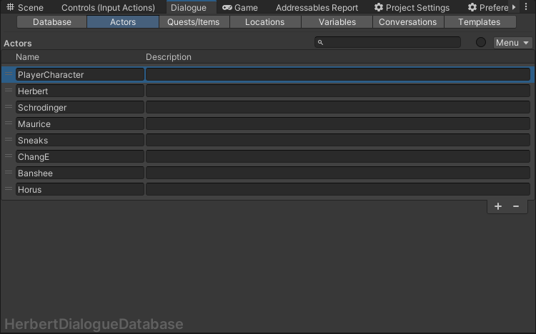
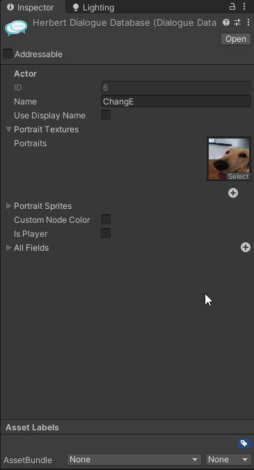
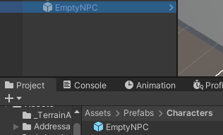
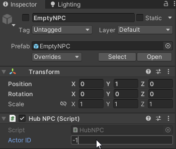
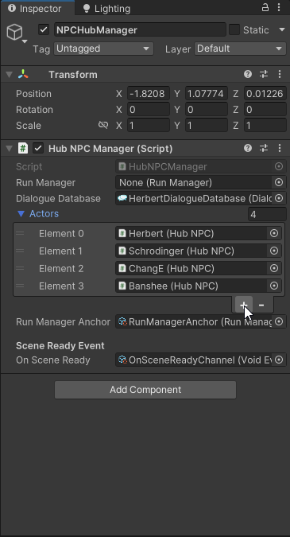
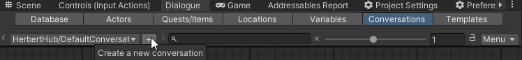
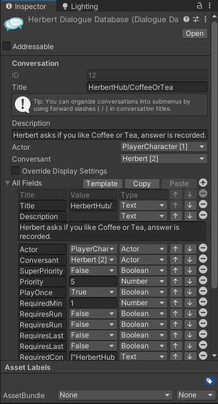
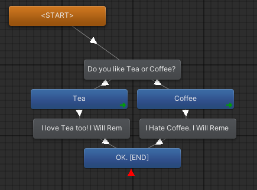
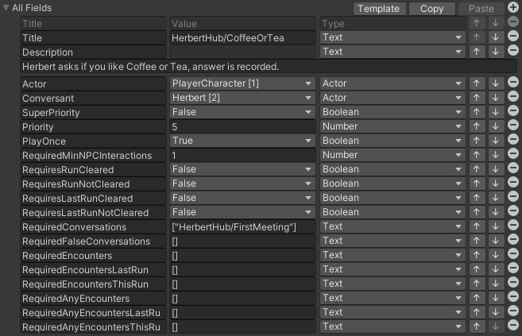

# Dialogue System

## Adding new Actor to the HUB

To add a new Actor to the hub

**In the Dialogue Editor Menu:**

The Dialogue Editor Menu can be found at the menu bar up the top under Tools->Pixel Crushers->Dialogue System->Dialogue Editor.
- Select the Actors tab (in between Database & Quests/Items) and Add a new Actor to the list.

- Change the _Name_ of the newly created actor and make sure it is selected, view the details of the actor in the right hand side inspector.
- Make a note of the _ID_ field (should be uneditable) and recall this as _ActorID_.
- Open the _Portrait Textures_ dropdown and drag in the actor's portrait art (Will eventually be replaced with _Portrait Sprites_ in due time)

**In the Hub_Location Scene:**

The Hub_Location scene can be found in the Project files under Scenes/Locations/Hub_Location.unity
- Drag an _EmptyNPC_ prefab from the Project files under Prefabs/Characters into the scene and rename and position it accordingly. Make sure the GameObject is disabled (Dark grey in the hierarchy).

- Keeping it selected, within the right hand side inspector, assign _Actor ID_ under the Hub NPC script to the previously noted _ActorID_ from the corresponding Actor entry under the Dialogue Editor Menu.

- Under the NPCHubManager object in the hierarchy, In the Hub NPC Manager script, open the Actors dropdown.
- Create a new element in the list, and drag in the EmptyNPC you've renamed and changed. 

The Actor should now be properly configured and become enabled once they have a conversation that allows them to spawn.

## Adding new conversation

**In the Dialogue Editor Menu:**
- Select the Conversations tab (in between Variables & Templates).
- Directly under the Conversations tab is the Conversations toolbar, press the (+) button next to the dropdown conversation selector to add a new conversation.

- Double click the empty space (the background grid) within the Conversation Graph window (this will default to selecting the conversation as a whole in the right hand side inspector).

- Change the Title field in the RHS inspector. Use naming convention NPC NAME/CONVERSATION TITLE to make use of submenus in the conversation selector. (i.e. "Maurice/FirstMeeting" without quotes)
- Take note of the _Actor_ and _Conversant_ fields. Change the _Conversant_ to the NPC who owns this conversation. Leave the _Actor_ field as PlayerCharacter.

Now you can edit the conversation flow using the main window (Conversation Graph). 

Grey nodes indicate the NPC is speaking, Blue nodes are the player. 

A Grey node that splits into multiple Blue nodes is a node that gives the PlayerCharacter a branching choice.

### Conversation settings & conditions

With the conversation selected (Select empty space (the grid) within the Conversation Graph window) open the _All Fields_ dropdown at the bottom of the RHS inspector.

Important fields to take note of are:

_RequiredConversations_ : Array of conversation Titles that need to have been triggered by the player before this conversation can spawn in. (Used for sequencing conversations across multiple runs)

_RequiredFalseConversations_: Array of conversation Titles that need to have **not** been triggered by the player before this conversation can spawn in. (Good for making sure that this conversation will not spawn in after a certain event/conversation)

_RequiredMinNPCInteractions_: Amount of total conversations the player has to have had before this conversation can spawn in. (Good for random quips that aren't integral to the storyline)

_Priority_: Numerical priority ranking for deciding which conversation to spawn in if there are multiple valid options. (Lower number is higher priority)

_PlayOnce_: If true this conversation will not spawn in again after it has triggered once.

Other fields/conditions are not tested/fully implemented yet.