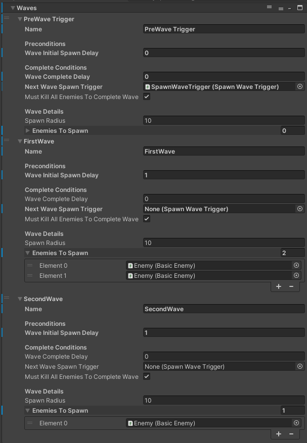

# Spawning Enemies

When entering a [Location](), the EnemySpawnManager (if present) will lock the PlayerExit (if present) and prepare to spawn the first wave of enemies.

Each wave has its own preconditions for spawning and conditions to be considered complete.

When all waves have been considered complete, the EnemySpawnManager will unlock the PlayerExit.

## Prerequisites
To start using the EnemySpawnManager, there needs to be:

Within the Scene:
1)  An A* prefab object (this is the navmesh that the enemies will use to spawn and walk upon).
2)  EnemySpawnManager prefab (this comes with mostly empty values and should be set up manually).

Outside of the Scene:
1) The PersistentManagers scene needs to be additively loaded alongside the current scene (This should be done automatically). The EnemySpawnManager listens and waits upon the OnSceneReady channel to start spawning enemies.

Optionally, you might also need:
1) PlayerExit prefab (with the "PlayerExit" tag).

All of these can be found in the Assets/Prefabs folder.

## Assigning enemies to spawn

Waves will not spawn until the previous wave has been cleared.
Under waves, click the plus button to add a new wave.

### Wave details

Populate the enemiesToSpawn array with enemy prefabs under Assets/Prefabs/Enemies.
Feel free to use duplicate entries in order to spawn more than one of the same type of enemy.

#### Preconditions
Preconditions dictate what needs to happen _before_ spawning in the wave.

__waveInitialSpawnDelay__ : If assigned to the first wave, it will spawn n seconds after OnSceneReady.\
Subsequent waves will spawn n seconds after the previous wave has been considered Complete.\
Good to keep this >0.5 in order to give the player some time to breathe when entering a location or after a wave.

#### Complete Conditions
Complete conditions dictate what needs to happen for the wave to be considered complete, so the EnemySpawnManager can consider the next wave, or to unlock the PlayerExit if this is the last wave.\
Each of these is completely optional, and if left unassigned or set to 0 will not be calculated.

__waveCompleteDelay__ : Will allow the wave to complete n seconds after spawning

__nextWaveSpawnTrigger__: If assigned a SpawnWaveTrigger, it will not consider the current wave complete until the player walks through the SpawnWaveTrigger.

__mustKillAllEnemiesToCompleteWave__: Self explanatory

## Example
The following example will has three "Waves", although only two waves actually spawn in enemies.

The first "PreWave Trigger" is an empty Wave with no enemies assigned, and its nextWaveSpawnTrigger is assigned to a SpawnWaveTrigger somewhere in the map.\
This will prevent the next wave (the first enemy spawning wave) from activating until the player enters the assigned SpawnWaveTrigger.

The second wave "FirstWave" is the first wave which will actually spawn in enemies, after 1 second (waveInitialSpawnDelay) of the player "completing" the previous wave (Entering the SpawnWaveTrigger).

The third wave "SecondWave" will activate 1 second (waveInitialSpawnDelay) after the previous wave is completed ("FirstWave" requires all enemies in the wave killed to complete (mustKillAllEnemiesToCompleteWave))

