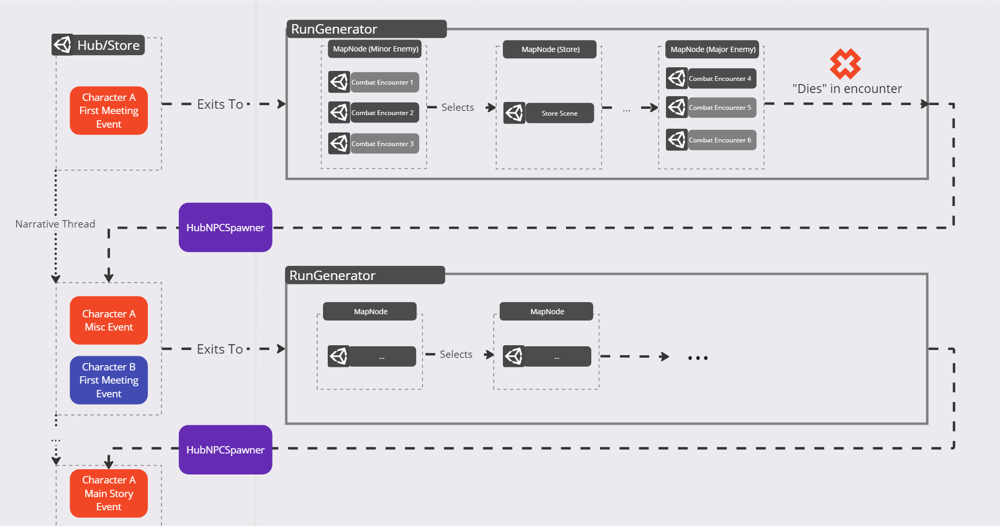

# Kitsune Corner (Working title)
> Narrative focussed roguelite with store management.

https://github.com/pmuenjohn/roguelite  
This is the birds-eye-view Design Documentation for Kitsune Corner (Working title).
For more in-depth or implementation specific documentation, see the [Manual](https://pmuenjohn.github.io/roguelite/manual/overview.html) (also in the navbar above) for details.

To edit this document please only edit the README.md file, the github-pages will be updated automatically after you commit README.md, and use [Github Flavored Markdown (GFM)](https://docs.github.com/en/get-started/writing-on-github/getting-started-with-writing-and-formatting-on-github/quickstart-for-writing-on-github)

## Overview


Play as a shape-shifting Kitsune who runs a Melbourne based pencil store by day, and hunts for various trinkets and supplies during the night.

Build relationships with new customers that arrive at your store each day. Listen to their stories and serve them their favourite items to learn new abilities and unlock new recipes.


## Team

- Writer/Producer: Audrey He 103597518
- Programmer: Peamawat Muenjohn 102326287
- Programmer: Ricky Huo 101453511
- Artist 2D/3D: Brittany Holmes 101116966
- Designer: Ethan Babatsikos 103619218

## Platforms

The game will be built for PC to be played on mouse and keyboard, however the controls are designed to easily map and copy onto a controller for players who prefer a hand held experience.  
Various successful roguelikes have been released and made available on PC and the Nintendo Switch.  
These include The Binding of Isaac, Hades, Risk of Rain 2, Enter The Gungeon. 

The controls in the game will be programmed onto mouse and keyboard giving players easy and comfortable ergonomic access to use all available abilities without straining their hands. 

In a research report done by DFC Intelligence, it is found that approximately 48% of all gaming happens on PC. Releasing this game on PC gives access to a wider player base.


## Machinery

Players will play as a Kitsune in human form during the day time and a fully transformed nine-tailed fox at night who goes out to hunt.

> During the day, players run a pencil shop where NPC customers arrive to purchase writing goods.
> 
> During the night, they will fight through a randomly generated route of combat encounters, gaining abilities and resources along the way.

To activate night-time, players can close their shop to time-skip to night.


Enemy(Ricky)
Different enemy will spawn and attack the player.

### Macro Gameplay Loop



[Link to diagrams on Miro](https://miro.com/app/board/uXjVMZTNF-k=/?share_link_id=762415482083)

The hub scene acts as the vehicle for the main narrative, whilst the combat acts as the main gameplay pull. 

### Micro Gameplay Loops

#### Roguelite Gameplay Overview

Kit has nine abilties corespondent to her nine-tails. As Kit is a fox, she has the abilities to dig into the ground where dirt is present to avoid enemies and act as a invulnerable ability.

There will be various enemies within the game with unique abilities and movesets. The main form of enemies are known as wisps. Enemies will drop items that can be brought back to the shop and used as equipment and ingredients for the pens. For example, blue enemies will drop blue pigments that can be used for blue ink. Kit will also have to battle the final boss who has an upgraded moveset and power level compared to other and previous enemies.

After each level is completed, random drops will occur. This can include Modulars, fish and power-ups. Fish can be used to exchange goods with Hebert the bear, who is a lonely shop keeper. Herbert randomly spawns in between levels and has a small stall where goods can be exchanged given the player has enough fish. Power-ups can also randomly drop which powers up Kit's abilties and movesets.

The levels are all randomly generated based on locations of Melbourne. There is no set order that the level come and go. As the levels are based on Melbourne locations, the traps are also fixated on distinguishable Melbourne attributes such as tram traps. Trams go pass in levels that are applicable and can collide with Kit and the enemies. Collison will result in being damaged and stunned as well as pushed.

#### Hub/Storefront Gameplay Overview

The gameplay during this time will mainly revolve around making stationary for the customers based on their preferences.

This includes using various components of a pen such as pigment colour, body build and thin/thickness to create the pencil of the customer's desires.

Players also interact with the customer learning around their own stories as the game progresses. The relationship and story you build with the customer may be affected by your choices as well as fulfilling their needs.  
Building a strong relationship with the customer can benefit the player's combat and stats at night. 

Customers will pay with the in-game world currency known as Modulars. Modular coins can be used to upgrade the shop game-play wise or simply its appearance.

### Systems
(TODO: link to and write manual pages)

#### Scene Loading

#### Narrative System

#### Storefront Gameplay

#### Map Generation System

#### Combat System

Combat will be majoritly based on shooting projectiles at enemies, but you will also have a melee ability at your disposal. As the game progresses, you will unlock a total of 8 different projectiles. Each weapon represents a tail of the Kitsune, and will do the following:
```
Regular tail: Melee weapon.
Lightning Chain: Hits multiple enemies for chain damage (lock on).
Fire: Inflicts burn damage.
Ice: Slows enemies.
Earthquake: Inflicts impact damage on enemies in a straight line.
Poison: Reduces enemies total health by a percentage.
Piercing: Can hit multiple enemies (aimed).
Boomerang: Will inflict damage on initial release and when received.
Cupids Arrow: Will link enemy that's hit with the next closest enemy, any damage done to one will be inflicted on the other.

```

When attacking an enemy for the first time upon entering a room, you will attach your cast to the enemy you hit. Your cast will increase damage inflicted on that enemy, and your cast will be dropped once the enemy is defeated. You can regain your cast by picking it up after the enemy you affected is defeated or by entering the next room. You may not change the enemy that your cast is on until it is defeated.


#### Perk/Ability System

As you progress through the game and create bonds with the NPCs, you will gain passive perks and abilities. Each NPC will be able to give you a passive perk that you will keep throughout the game and will stack with other passive perks you may receive from other NPCs. When you complete a relationship with an NPC, you will receive an ultimate ability. You may unlock multiple ultimates, but you may only equip one at a time. These abilities and perks will be active in every run, and will stay with you when you die. 


## Brand Identity

Kitsune Corner is fully designed and produced in the heart of Melbourne. Therefore, the setting of the game is also fully based in a cyberpunk, synthwave futuristic fantasy version of Melbourne Victoria.  
Unlike other Melbourne based games, Kitsune Corner aims to integrate various Melbourne street culture and location within the game. All the levels in the game will be various locations of the Melbourne CBD including famous iconic spaces such as Federation Square, Southbank Walk and Hozier Lane. There will also be less known locations that are still a symbol of Melbourne such as The Block Arcade.

According to the UNESCO Institute for Statistics, in 2018 the United States of America accounted for 24% of global cultural creative export. This includes many forms of entertainment like Films, video games, music and other media items. This means that various of these contents display American landmarks and locations. Australia is only known for 6.5% of contribution in the creative and cultural industries in 2019. 

The game will also comprise characters from different cultural folklore. Melbourne is a very diverse and multicultural city with a significant population of people from different cultural backgrounds. In fact, almost half of the population in Melbourne are either born overseas or have at least one parent who was born overseas (Australian Bureau of Statistics 2016 Census). Having these different cultural characters will highlight the city's multiculturalism.

Kitsune Corner aims to impress players with the games take on the cyberpunk aesthetic and its hand drawn 2D illustrations. The game also aims to generate connectivity within Australian players, particularly those who reside in Melbourne and display the identical levels to the locations of Melbourne.


## Schedule


https://gamecapstone2023.atlassian.net/jira/software/projects/CP/boards/1

## Narrative

Kit was an unnamed Kitsune who was given their name by Winnie. She was physically cursed into a room due to her past action that brought shame upon the Deity. She decided to revamp the room and refurnish it into a shop, pen shop to be exact. Believing pens have different uses and variations which to unique and special to everyone. Felt tips, ball-ink, gel-ink, Kit knew it all. She was happy running her shop, she found that as a Kitsune she was able to escape her physical body and roam as a soul at night. She discovers from Schrodinger that you can unbind yourself if you prove yourself worthy top the Deity. Kit initially has no interest in this as she is content with staying in her shop.

Conflict: Wisps originally have always been around but as Kit progresses through the game, more and more powerful wisps are starting to show up almost overpowering other hostile creatures. She discovers that there is a wisp summoner who self-proclaims himself as the King of Wisps who takes control of the streets. Kit is interested in finding out more about them.

She becomes determined to stop them as they are making her hunting process more difficult. The wisp summoner gains the ability to take souls from the living and convert them into wisps along with their physical form from the blue stone (which Kit also obtains and becomes stronger). He entraps Schrodinger and turns him into a wisp to become his ultimate vessel. Kit must also stop him before Schrodinger becomes a wisp forever with no return. 

At some point, Kit also discovers that the Wisp Commander is also physically trapped somewhere, and he is also just a walking spirit. The initial boss fight was only Kit fighting his spirit but the final boss fight with him is Kit fighting his physical body. Both Kit and the Wisp Commander must get to each other’s physical body before the other one does.

### Characters

List of all Characters:  
```
Kit: Player  
Winnie: Wisp sidekick/guide  
Schrodinger: Customer  
Chang-E: Customer  
Banshee: Customer  
Horus: Customer  
Milton: Customer  
Aziel: Main enemy/Final boss  
Herbert: Upgrade keeper 
```

## Concept Art

Below are the character concepts completed by our 2D artist:

Kit Outfit Designs:


Kit Turnaround:


Kit (Fox form) Turnaround:


Kit Concept Art (Colourway 1):


Kit Concept Art (Colourway 2):

